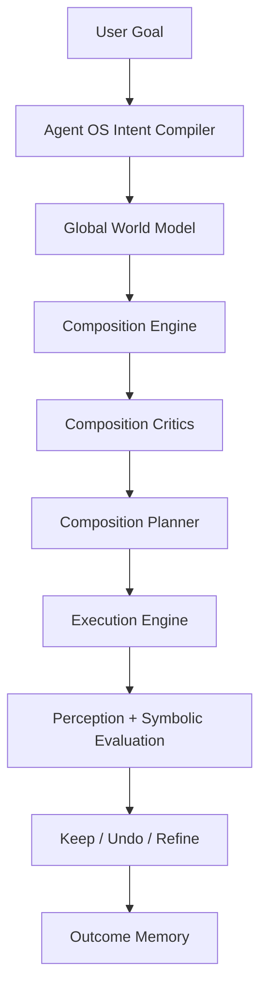

# LivePilot Composition Engine v1

Status: proposal

Audience: product, agent/runtime, arrangement/composition, perception, memory, and workflow authors

Purpose: define the composition and arrangement intelligence layer for LivePilot.

The Composition Engine is the part of LivePilot that should make the system feel like a serious producer, arranger, and musical director rather than a tool caller that happens to know some theory.

Externally, the user should be able to say:

- "turn this loop into a real verse"
- "make this section build tension"
- "make the chorus lift without sounding corny"
- "give this arrangement more narrative"
- "make the automation feel musical"
- "research how this style handles transitions and use what fits"

Internally, the system should:

- understand form, phrase, role, and tension
- analyze motifs, harmony, rhythm, orchestration, and transitions
- compose with real feedback from perception layers
- treat automation as musical gesture, not knob scribbling
- evolve material across time without flattening user taste

This document is a companion to Agent OS, not a replacement for it. Agent OS defines the top-level operating model. Composition Engine defines the specialized intelligence stack for musical structure and time-based storytelling.

## Related Materials

This proposal is designed to sit alongside the current repo architecture and documentation:

- [AGENT_OS_V1.md](./AGENT_OS_V1.md)
- [COMPOSITION_ENGINE_V1_INTEGRATION_PLAN.md](./COMPOSITION_ENGINE_V1_INTEGRATION_PLAN.md)
- [LIVEPILOT_SYSTEM_ARCHITECTURE_V1.md](./LIVEPILOT_SYSTEM_ARCHITECTURE_V1.md)
- [LIVEPILOT_IMPLEMENTATION_ROADMAP_V1.md](./LIVEPILOT_IMPLEMENTATION_ROADMAP_V1.md)
- [PROJECT_BRAIN_V1.md](./PROJECT_BRAIN_V1.md)
- [EVALUATION_FABRIC_V1.md](./EVALUATION_FABRIC_V1.md)
- [MEMORY_FABRIC_V2.md](./MEMORY_FABRIC_V2.md)
- [TRANSITION_ENGINE_V1.md](./TRANSITION_ENGINE_V1.md)
- [RESEARCH_ENGINE_V1.md](./RESEARCH_ENGINE_V1.md)
- [TOOL_REFERENCE.md](./TOOL_REFERENCE.md)
- [M4L_BRIDGE.md](./M4L_BRIDGE.md)
- [../livepilot/agents/livepilot-producer/AGENT.md](../livepilot/agents/livepilot-producer/AGENT.md)
- [../livepilot/skills/livepilot-core/SKILL.md](../livepilot/skills/livepilot-core/SKILL.md)
- [../mcp_server/tools/arrangement.py](../mcp_server/tools/arrangement.py)
- [../mcp_server/tools/automation.py](../mcp_server/tools/automation.py)
- [../mcp_server/tools/theory.py](../mcp_server/tools/theory.py)
- [../mcp_server/tools/harmony.py](../mcp_server/tools/harmony.py)
- [../mcp_server/tools/analyzer.py](../mcp_server/tools/analyzer.py)
- [../mcp_server/tools/perception.py](../mcp_server/tools/perception.py)
- [../mcp_server/curves.py](../mcp_server/curves.py)

## 1. Vision

LivePilot should eventually have composition intelligence that feels like working with:

- an arranger who understands section function
- a producer who hears tension and release
- a composer who recognizes motifs and voice-leading
- a musical director who knows when to subtract, hand off, and reframe
- an automation artist who writes gesture, not random motion

The core shift is this:

- Mixing intelligence answers: "What sounds wrong or weak right now?"
- Composition intelligence answers: "What should happen next, why, and over what timescale?"

The best composition agent is not the one that generates the most notes. It is the one that best understands:

- what role each element is playing
- what the current section is trying to be
- what kind of contrast is missing
- what the listener has already heard too many times
- how to create movement without clutter
- how to make automation feel intentional and musical

## 2. Product Principle

Composition Engine v1 should obey one product principle:

- Deep internal musical reasoning
- Simple external creative control

The user should not need to specify:

- section graphs
- phrase boundaries
- motif transformations
- harmonic instability targets
- automation curves
- contrast matrices

The user should only need to express:

- direction
- taste
- intensity
- references when desired

The system should build everything else internally.

## 3. Non-Goals

Composition Engine v1 does not attempt to:

- replace the artist's taste with autonomous songwriting
- generate a full finished song in one blind pass
- impose genre formulas where the session already has a strong identity
- treat more notes as better composition
- use automation constantly just because it is available
- mimic references mechanically
- depend on web access for normal composition work

## 4. Relationship To Agent OS

Composition Engine is a specialized subsystem inside Agent OS.

Agent OS owns:

- intent compilation
- global world model
- safety and trust
- general planning and evaluation
- research capability routing
- top-level memory behavior

Composition Engine owns:

- section understanding
- phrase understanding
- role and motif understanding
- harmony and progression intelligence
- transition logic
- musical automation authoring
- arrangement-specific evaluation



Composition Engine should be invoked whenever the task is primarily about:

- arrangement
- form
- harmony
- melodic development
- rhythmic development
- call-and-response
- transitions
- narrative pacing
- automation as musical expression

## 5. Design Commandments

The engine should be built around these rules:

1. Never treat arrangement as clip duplication with nicer words.
2. Never treat automation as decorative movement.
3. Never compose without reading the current musical material first.
4. Always reason across multiple timescales.
5. Prefer the smallest structural move that creates real contrast.
6. Subtraction is a first-class composition move.
7. Preserve identity while increasing development.
8. If a loop is already strong, promote it into a section instead of rewriting it from scratch.
9. Composition quality should be evaluated from both symbolic and sonic evidence.
10. The engine should learn style and taste from accepted outcomes, not from theory alone.

## 6. Timescales

Composition intelligence must operate on three timescales at once.

### 6.1 Micro Timescale

Scope:

- sub-beat to 1 bar
- note contour
- fills
- pickup notes
- rhythmic punctuation
- micro-automation gestures

Questions:

- Is the groove too rigid?
- Is there enough local contour?
- Do phrase endings have punctuation?
- Is automation helping the rhythm or fighting it?

### 6.2 Meso Timescale

Scope:

- 2 to 16 bars
- phrases
- call-and-response
- sectional texture
- automation arcs
- turnarounds

Questions:

- Does the phrase complete itself?
- Is there repetition fatigue?
- Is there enough contrast inside the section?
- Are arrivals, handoffs, and resets musically convincing?

### 6.3 Macro Timescale

Scope:

- 16 bars and above
- full sections
- intro/verse/build/drop/bridge/outro logic
- reveal pacing
- energy arc
- emotional narrative

Questions:

- Does this section function correctly?
- Does the song reveal too much too early?
- Where should intensity rise or fall?
- Is the arrangement telling a story or looping in place?

## 7. Composition World Model

Composition Engine should extend the general Agent OS world model with a dedicated composition representation.

### 7.1 Core Objects

The engine should maintain:

- Section Graph
- Phrase Grid
- Role Graph
- Motif Graph
- Harmony Field
- Gesture Map
- Tension Model
- Contrast Matrix
- Development State

### 7.2 Section Graph

A `Section Graph` represents structural identity over time.

Each section node should capture:

- start and end bars
- inferred section type
- energy target
- density target
- harmonic stability target
- foreground elements
- reveal state
- transition needs

Section types:

- loop
- intro
- pre-verse
- verse
- pre-chorus
- chorus
- build
- drop
- bridge
- breakdown
- outro
- unknown

Important principle:

If the user only has one loop, the engine should still infer its likely section role and what kind of neighboring sections it could grow into.

### 7.3 Phrase Grid

A `Phrase Grid` tracks phrase units and internal shape.

Each phrase unit should know:

- bar span
- cadence strength
- pickup presence
- response relation
- variation status
- boundary evidence

The system should detect phrase boundaries from:

- note density changes
- onset peaks
- novelty spikes
- harmonic changes
- silence windows
- automation resets
- turnarounds and fills

### 7.4 Role Graph

A `Role Graph` models what each track or clip is doing musically.

Possible roles:

- pulse
- kick anchor
- bass anchor
- hook
- lead
- harmony bed
- rhythmic punctuation
- counterline
- texture wash
- impact accent
- transition FX
- space/depth support

The same track may have different roles in different sections.

That means role inference must be section-aware, not global.

### 7.5 Motif Graph

A `Motif Graph` stores recurring musical DNA across notes and rhythms.

Motifs may be:

- melodic
- rhythmic
- intervallic
- timbral
- automation-based
- sectional

Each motif should track:

- identity
- occurrences
- transformations
- salience
- exhaustion risk
- best next development strategies

### 7.6 Harmony Field

A `Harmony Field` represents:

- key center
- modal ambiguity
- chord progression
- functional vs modal motion
- voice-leading quality
- instability/resolution

This should be built from:

- `analyze_harmony`
- `suggest_next_chord`
- `detect_theory_issues`
- `identify_scale`
- `harmonize_melody`
- `generate_countermelody`
- `transpose_smart`
- `navigate_tonnetz`
- `find_voice_leading_path`
- `classify_progression`
- `suggest_chromatic_mediants`

### 7.7 Gesture Map

A `Gesture Map` represents automation and time-based musical actions as expressive events.

This is not just "there is automation on filter cutoff."

It should know:

- where gestures begin and resolve
- what they are trying to do musically
- which other tracks they complement or conflict with
- whether the gesture is foreground or background
- whether the gesture supports phrase or section logic

### 7.8 Tension Model

The `Tension Model` estimates how much musical tension is present and why.

Tension sources:

- harmonic instability
- rhythmic compression
- density increase
- spectral brightening
- widening and narrowing
- automation acceleration
- register lift
- pre-arrival subtraction
- cadence delay

The system should represent both:

- local tension
- long-arc tension

### 7.9 Contrast Matrix

A `Contrast Matrix` compares neighboring phrases and sections across:

- density
- harmony
- register
- width
- loudness
- motion
- orchestration
- automation intensity

This is how the engine decides whether two sections are too similar or whether a transition is earning its arrival.

## 8. Evidence Model

Composition Engine should be grounded in actual evidence, not pure language modeling.

### 8.1 Session and Arrangement Evidence

Use:

- `get_session_info`
- `get_track_info`
- `get_clip_info`
- `get_arrangement_clips`
- `get_arrangement_notes`
- `get_cue_points`
- `jump_to_time`
- `create_arrangement_clip`
- `modify_arrangement_notes`
- `duplicate_arrangement_notes`

### 8.2 Symbolic and Theory Evidence

Use:

- `get_notes`
- `analyze_harmony`
- `suggest_next_chord`
- `detect_theory_issues`
- `identify_scale`
- `harmonize_melody`
- `generate_countermelody`
- `transpose_smart`
- `classify_progression`
- `find_voice_leading_path`

### 8.3 Sonic and Perceptual Evidence

Use:

- `get_master_spectrum`
- `get_master_rms`
- `get_chroma`
- `get_onsets`
- `get_novelty`
- `get_momentary_loudness`
- `capture_audio`
- `analyze_loudness`
- `analyze_spectrum_offline`
- `compare_to_reference`

### 8.4 Automation and Gesture Evidence

Use:

- `get_clip_automation`
- `get_automation_state`
- `apply_automation_shape`
- `apply_automation_recipe`
- `generate_automation_curve`
- `set_clip_automation`
- `set_arrangement_automation`
- `analyze_for_automation`

### 8.5 Memory and Research Evidence

Use:

- outcome memory
- technique cards
- style/taste memory
- user-supplied references
- connected documentation and research sources when available

## 9. Composition Analysis Pipeline

The engine should analyze in this order:

1. infer the composition scope
2. map section candidates
3. detect phrase structure
4. infer track roles
5. extract motifs
6. analyze harmony and voice-leading
7. estimate tension and contrast curves
8. inspect gesture and automation behavior
9. produce issue and opportunity graphs

### 9.1 Infer Composition Scope

First determine what kind of compositional problem this is:

- single loop development
- section improvement
- section-to-section transition
- arrangement expansion
- harmonic development
- automation musicality
- style translation
- full form refinement

The engine should never use a macro-level solution for a micro-level problem.

### 9.2 Section Inference

Section inference should use both symbolic and perceptual signals.

Evidence for section identity:

- active track count
- bass and kick intensity
- harmonic density
- phrase length
- loudness profile
- novelty spikes
- automation density
- cue point positions
- repeated arrangement clip spans

Examples:

- sparse reveal + low density + low bass commitment -> intro-like
- stable harmonic support + medium density + space around lead -> verse-like
- high density + rising brightness + pre-impact subtraction -> build-like
- strongest arrival + highest role commitment + widest image -> chorus/drop-like

### 9.3 Phrase Boundary Detection

Phrase boundaries should be detected from:

- cadence note clusters
- rhythmic stop/start
- harmonic pivots
- fill events
- onset bursts
- novelty peaks
- automation turnarounds
- bar-strong contrast

Phrase detection matters because most musical automation should be phrase-aware, not continuous across unrelated boundaries.

### 9.4 Role Inference

Role inference should combine:

- register
- onset pattern
- note density
- device class
- track name
- spectral occupancy
- rhythmic regularity
- section context

Role inference examples:

- low register + periodic on-beat accents + sub energy -> bass anchor
- bright top + irregular small hits + no harmonic center -> rhythmic punctuation
- sustained mid/high notes + low onset count -> harmony bed
- repeating salience peaks + melodic contour -> hook or lead

### 9.5 Motif Extraction

Motif extraction should identify recurring shapes, not just exact duplicates.

The engine should look for:

- interval patterns
- contour signatures
- rhythm signatures
- accent shapes
- phrase-ending markers
- automation signatures

Transformations to track:

- transposition
- inversion
- rhythmic compression or expansion
- displacement
- register shift
- timbral reassignment
- fragmentation
- answer phrase creation

### 9.6 Harmony Analysis

The engine should distinguish:

- functional motion
- modal motion
- chromatic side-steps
- voice-leading elegance
- harmonic stasis
- tension-producing ambiguity

It should know the difference between:

- a progression that is intentionally hypnotic
- a progression that is just underdeveloped

### 9.7 Tension and Contrast Estimation

The engine should derive high-level curves such as:

- energy curve
- density curve
- harmonic stability curve
- novelty curve
- foreground occupancy curve
- width curve
- automation intensity curve

These curves should become the basis for compositional critique.

### 9.8 Gesture and Automation Inspection

Before writing new automation, the engine should inspect what already exists.

Questions:

- Is automation already carrying narrative?
- Are multiple tracks competing for motion at once?
- Are gestures supporting section function?
- Are gesture peaks aligned with phrase boundaries?
- Is there too much constant motion?

## 10. Composition Critics

Composition Engine should use a dedicated critic stack.

Each critic should emit:

- issues
- opportunities
- severity
- confidence
- evidence
- recommended move classes

### 10.1 Form Critic

Focus:

- full structure
- reveal schedule
- macro contrast
- pacing of energy and information

Typical findings:

- reveals too much too early
- no convincing arrival point
- all sections feel equally important
- bridge does not recontextualize material

### 10.2 Section Identity Critic

Focus:

- whether a section actually behaves like its intended role

Typical findings:

- verse too dense, leaves no room for later lift
- drop lacks anchor elements
- build has motion but no pressure
- intro sounds like the chorus already started

### 10.3 Phrase Critic

Focus:

- phrase completion
- cadence clarity
- internal response structure
- pickup and turnaround logic

Typical findings:

- phrase endings never resolve
- bar 4 and bar 8 land identically
- no response phrase after the hook statement

### 10.4 Motif Critic

Focus:

- motif salience
- motif exhaustion
- development quality
- memorability

Typical findings:

- good motif introduced but never developed
- repeated pattern with no contour change
- too many motif candidates competing for identity

### 10.5 Harmony Critic

Focus:

- progression strength
- modal coherence
- voice-leading
- tension/release
- harmonic pacing

Typical findings:

- harmony too static for requested emotional movement
- strong chord choices but awkward voice-leading
- constant instability with no true landing

### 10.6 Rhythm and Groove Critic

Focus:

- rhythmic identity
- syncopation management
- micro-variation
- groove continuity across sections

Typical findings:

- groove locked too tightly to grid
- hats/percussion repeat exactly every cycle
- transition breaks groove instead of redirecting it

### 10.7 Orchestration Critic

Focus:

- register allocation
- role clarity
- foreground/background balance
- density by band and role

Typical findings:

- too many foreground voices
- no stable harmonic bed
- low-mid role collision between bass and chords
- key supporting textures never rotate forward

### 10.8 Gesture Critic

Focus:

- musicality of automation
- gesture timing
- complementary motion
- phrase-bound alignment

Typical findings:

- automation is constant but narratively empty
- filter motion fights the groove
- width blooms happen at the wrong moments
- too many elements swell together

### 10.9 Transition Critic

Focus:

- arrivals
- exits
- pre-impact preparation
- handoffs
- carry-over tails

Typical findings:

- section boundary is audible but not meaningful
- no pre-arrival subtraction
- transitions rely on FX without harmonic or rhythmic support

### 10.10 Emotional Arc Critic

Focus:

- whether the piece moves emotionally in the requested direction

Typical findings:

- arrangement gets louder but not more moving
- harmonic color and texture contradict the stated intent
- lift is technical, not emotional

### 10.11 Taste and Style Critic

Focus:

- user preference fit
- genre logic
- reference compatibility
- overuse of generic tricks

Typical findings:

- technically strong transition but too obvious for this user's taste
- arrangement move fits EDM norms but not the current aesthetic

## 11. Composition Move Library

The planner should not improvise from nothing. It should choose from a library of musical move classes.

### 11.1 Structural Moves

- section expansion
- section compression
- reveal deferral
- arrival strengthening
- breakdown insertion
- bridge reframing
- outro simplification

### 11.2 Phrase Moves

- add pickup
- add turnaround
- create response phrase
- cadence strengthening
- phrase extension
- phrase truncation

### 11.3 Motif Moves

- register shift
- rhythmic variation
- inversion
- answer phrase
- fragmentation
- orchestral reassignment
- automation-based restatement

### 11.4 Harmony Moves

- reharmonize support layer
- improve voice-leading
- add suspended/pre-cadential color
- modal borrowing
- chromatic mediant pivot
- simplify progression for stronger hook support

### 11.5 Groove Moves

- micro-timing variation
- accent redistribution
- density gating
- percussion role rotation
- syncopation rebalancing

### 11.6 Texture and Orchestration Moves

- foreground rotation
- background bloom
- density thinning
- register clearing
- sectional voicing change
- bass function retargeting

### 11.7 Transition Moves

- pre-impact vacuum
- riser with real harmonic support
- delay throw punctuation
- fill launch
- tail carryover
- kick/bass re-entry choreography

### 11.8 Gesture Moves

- reveal
- conceal
- widen
- narrow
- brighten
- darken
- push
- breathe
- suspend
- release
- bloom
- collapse

## 12. Automation As Composition

This is one of the most important ideas in the whole design.

Automation should be treated as composition, not post-composition decoration.

The system should understand automation as a layer that can:

- create anticipation
- signal section changes
- shift foreground focus
- articulate phrasing
- produce emotional lift
- control density and space
- animate timbre as musical identity

### 12.1 Gesture Grammar

The engine should author automation in terms of musical gestures.

Core gesture verbs:

- reveal
- conceal
- handoff
- inhale
- exhale
- lift
- sink
- bloom
- tighten
- destabilize
- stabilize
- punctuate
- suspend
- release
- smear
- focus
- drift
- ratchet

### 12.2 Gesture Object

Each gesture should store:

- musical intent
- section role
- phrase role
- target tracks
- target parameters
- curve family
- start bar
- resolution bar
- foreground or background status
- complementary gestures
- preservation constraints

### 12.3 Gesture Authoring Rules

1. Every gesture must justify its place in phrase or section logic.
2. Not every phrase needs visible automation.
3. Complementary motion is better than everyone moving together.
4. Motion should usually intensify near boundaries, not ignore them.
5. Gesture density should be budgeted per section.
6. The strongest gesture should usually belong to the section's dominant event.
7. Background drift and foreground punctuation should not be confused.

### 12.4 Gesture Families

#### Reveal

Musical use:

- open filter
- introduce width
- grow send level
- unmask upper harmonics

Best for:

- section entries
- phrase second halves
- build ramps

#### Conceal

Musical use:

- close filter
- narrow image
- reduce send
- darken support layers

Best for:

- making space
- pre-arrival clearing
- verse restraint

#### Handoff

Musical use:

- one voice dims while another emerges
- delay/reverb tail bridges the transfer

Best for:

- call-and-response
- hook to counterline transfer
- section pivots

#### Inhale

Musical use:

- pull energy or low end back before impact

Best for:

- pre-drop
- pre-chorus to chorus
- turnaround into new phrase

#### Release

Musical use:

- restore weight, width, or harmonic color after tension

Best for:

- arrivals
- chorus payoff
- breakdown resolution

### 12.5 Mapping Gestures To Current Tooling

Composition Engine v1 should directly exploit the current automation surface:

- `apply_automation_shape` for curve families
- `apply_automation_recipe` for named recipes
- `generate_automation_curve` for planning and preview
- `set_clip_automation` for precise session-clip gestures
- `set_arrangement_automation` for timeline gestures
- `analyze_for_automation` for target suggestions
- `get_clip_automation` and `get_automation_state` before overwriting

The curve library in [../mcp_server/curves.py](../mcp_server/curves.py) is a major asset here.

Examples:

- `easing` for reveal and release
- `spike` for punctuation and throws
- `euclidean` for rhythmic gating patterns
- `perlin` or `brownian` for background drift
- `spring` for elastic expressive movement
- `sine` for subtle tremolo/pan breathing
- `stochastic` for constrained evolving motion

### 12.6 Musical Automation Templates

Composition Engine should ship with higher-level templates such as:

- pre-arrival vacuum
- sectional width bloom
- phrase-end throw
- turnaround accent
- bass tuck before kick return
- harmonic tint rise
- pad inhale / bloom
- response echo
- texture drift bed
- tension ratchet
- re-entry spotlight
- outro decay dissolve

These templates should be expressed as gesture plans, not hardcoded parameter dumps.

## 13. Perception Fusion

Composition Engine should use perception layers to understand time, tension, and development, not just mix quality.

### 13.1 Derived Curves

The engine should derive:

- `energy_curve`
- `density_curve`
- `harmonic_stability_curve`
- `novelty_curve`
- `foreground_occupancy_curve`
- `width_curve`
- `brightness_curve`
- `gesture_intensity_curve`
- `transition_sharpness_curve`
- `repetition_fatigue_curve`

### 13.2 Example Derivations

These do not need to be mathematically perfect in v1. They need to be useful and stable.

`energy_curve`

- onset density
- momentary loudness
- high-mid activity
- low-end commitment
- gesture intensity

`density_curve`

- notes per beat
- active track count
- rhythmic event count
- automation event density

`harmonic_stability_curve`

- key confidence
- chroma concentration
- cadence detection
- dissonance or ambiguity proxy

`repetition_fatigue_curve`

- motif recurrence without transformation
- low novelty
- repeated orchestration
- repeated phrase endings

`transition_sharpness_curve`

- pre/post novelty delta
- loudness/density shift
- width shift
- harmonic pivot strength
- gesture convergence

### 13.3 Why This Matters

These curves let the system answer questions like:

- Is the section actually building?
- Is the chorus larger, or just louder?
- Is the arrangement evolving, or only changing timbre?
- Is the phrase ending earning its cadence?
- Is automation creating movement, or just occupying space?

## 14. Closed Composition Loops

Composition changes should never be purely speculative.

The engine should compose through loops.

### 14.1 Micro Loop

Use for:

- fills
- pickups
- motif tweaks
- automation punctuation

Loop:

1. detect local issue
2. propose 1 to 3 micro fixes
3. apply smallest fix
4. re-read notes or automation
5. evaluate local musicality
6. keep or undo

### 14.2 Phrase Loop

Use for:

- phrase completion
- response writing
- turnaround design
- phrase-bound automation

Loop:

1. read phrase grid
2. identify flat or incomplete phrases
3. add one phrase-level move
4. render/listen if needed
5. score phrase satisfaction

### 14.3 Section Loop

Use for:

- section identity
- orchestration
- role rotation
- internal contrast

Loop:

1. read section graph
2. critique role clarity and contrast
3. plan one sectional move
4. evaluate before vs after
5. keep or undo

### 14.4 Song Loop

Use for:

- reveal pacing
- macro contrast
- section ordering
- emotional arc

Loop:

1. compare section graph across the whole arrangement
2. detect macro weaknesses
3. test one macro move at a time
4. evaluate transitions and section distinctness
5. preserve identity while increasing arc

## 15. Evaluation

Composition Engine needs its own evaluator in addition to the general Agent OS evaluator.

### 15.1 Composition Success Criteria

A move should be considered good when it improves one or more of:

- section clarity
- phrase completion
- motif memorability
- tension/release effectiveness
- transition strength
- orchestration clarity
- emotional direction
- narrative pacing

while preserving:

- core identity
- groove integrity
- tonal coherence
- user taste

### 15.2 Evaluation Dimensions

Score each move on:

- section_fit
- phrase_fit
- narrative_gain
- measurable_delta
- preservation
- taste_fit
- confidence
- reversibility

### 15.3 Example Acceptance Rules

- keep if section identity improves without collapsing groove
- undo if novelty rises but phrase coherence falls sharply
- undo if automation motion increases while musical intent stays unclear
- ask before escalating if the engine must rewrite a core motif

### 15.4 Composition-Specific Failure Modes

Watch for:

- over-arranging
- too many simultaneous changes
- adding variation where identity is needed
- forcing harmonic movement into a hypnotic minimal context
- replacing tension with loudness
- making transitions busier but not stronger

## 16. Memory and Knowledge

Composition quality improves dramatically if the system remembers outcomes, not just techniques.

### 16.1 Composition Memory Types

- section outcome memory
- motif memory
- phrase resolution memory
- transition memory
- gesture card library
- style/taste composition memory
- anti-memory for failed arrangement ideas

### 16.2 Section Outcome Memory

Store:

- section type
- context
- move applied
- result
- user reaction

Example:

- verse was too exposed
- support texture removed for first 4 bars
- delayed full harmony until bar 5
- user preferred the more patient reveal

### 16.3 Motif Memory

Store:

- motif identity
- how it was varied
- when variation worked
- when repetition became fatiguing

### 16.4 Gesture Cards

Store automation as musical cards, not just parameter data.

Each card should remember:

- intent
- context
- gesture family
- devices used
- best timing
- risks
- measured outcome

### 16.5 Style Memory

Style memory should capture:

- preferred section pacing
- harmony density
- amount of automation motion
- transition boldness
- repetition tolerance
- preferred reveal strategy

### 16.6 Anti-Memory

Store explicit negatives such as:

- this user dislikes obvious white-noise risers
- this project suffers when too many layers widen at once
- this motif collapses when over-harmonized

## 17. Research and Reference Study

Composition research should use the Agent OS research capability ladder.

It must not assume open-web access.

When research is requested, the composition system should look for:

- form norms
- section pacing
- harmonic language
- voice-leading tendencies
- rhythmic density logic
- motif development strategies
- transition devices
- automation/gesture behavior
- orchestration conventions

### 17.1 Research Questions The Engine Should Ask

- How does this style create lift without adding clutter?
- How do similar tracks handle verse-to-chorus reveal?
- What kinds of harmonic color are typical here?
- Are transitions usually harmonic, rhythmic, textural, or FX-driven?
- How much automation movement is idiomatic vs distracting?

### 17.2 Research Output

Research should become `Style Tactic Cards`, not just summaries.

```json
{
  "reference_style": "Burial-inspired UK garage ambience",
  "category": "transition design",
  "tactic": "use subtraction plus ghost tails instead of obvious risers",
  "why_it_works": "maintains haunted continuity while preserving emotional ambiguity",
  "composition_effect": ["transition_strength", "narrative_continuity"],
  "gesture_candidates": ["handoff", "conceal", "smear", "release"],
  "evidence": {
    "provider_types": ["session", "local_docs", "user_reference"],
    "web_used": false
  }
}
```

### 17.3 Research Use Policy

Do not apply a tactic directly just because it is "correct" for the style.

Instead:

1. map the tactic to the current section and material
2. derive one or two candidate moves
3. test the smallest one
4. keep it only if it improves the current music

## 18. User Experience Contract

Externally, the system should stay simple.

### 18.1 Good User Requests

- "turn this into a proper verse"
- "make the arrangement more alive"
- "make the drop feel earned"
- "give this motif development"
- "make the automation feel more musical"
- "research how to build a stronger transition here and apply the best subtle move"

### 18.2 Minimal User Controls

- push harder
- keep it subtle
- more emotional
- less busy
- more narrative
- more contrast
- fresh approach
- undo that direction
- research this style
- save this approach

### 18.3 Agent Response Pattern

At major checkpoints, the agent should say:

1. what it thinks the compositional problem is
2. what it found in the material
3. what structural move it is trying next
4. what changed musically
5. what it recommends doing next

The user should feel like they are steering a producer-arranger, not operating a music theory debugger.

## 19. Runtime Schemas

These are minimal shapes, not final code contracts.

### 19.1 CompositionGoal

```json
{
  "request_text": "turn this loop into a real verse with a stronger lift into the chorus",
  "scope": "section_and_transition",
  "target_dimensions": {
    "section_clarity": 0.30,
    "narrative_pacing": 0.25,
    "tension_release": 0.22,
    "motif_development": 0.12
  },
  "protect": {
    "groove": 0.92,
    "identity": 0.90,
    "clarity": 0.82
  },
  "mode": "improve",
  "research_mode": "none",
  "aggression": 0.40
}
```

### 19.2 SectionNode

```json
{
  "section_id": "sec_02",
  "start_bar": 17,
  "end_bar": 32,
  "inferred_type": "verse",
  "confidence": 0.74,
  "energy_level": 0.46,
  "density_level": 0.41,
  "harmonic_stability": 0.72,
  "foreground_roles": ["lead", "bass_anchor"],
  "transition_in_needs": ["clear_arrival"],
  "transition_out_needs": ["lift_preparation"]
}
```

### 19.3 PhraseUnit

```json
{
  "phrase_id": "phr_02b",
  "section_id": "sec_02",
  "start_bar": 21,
  "end_bar": 24,
  "cadence_strength": 0.38,
  "pickup_present": false,
  "response_to": "phr_02a",
  "variation_score": 0.19
}
```

### 19.4 RoleNode

```json
{
  "track_index": 4,
  "section_id": "sec_02",
  "role": "harmony_bed",
  "confidence": 0.81,
  "foreground": false,
  "register_band": "mid_high",
  "activity_level": 0.43
}
```

### 19.5 MotifUnit

```json
{
  "motif_id": "motif_lead_a",
  "kind": "melodic_rhythmic",
  "occurrences": [5, 13, 21],
  "salience": 0.77,
  "fatigue_risk": 0.58,
  "suggested_developments": ["answer_phrase", "register_shift", "rhythmic_variation"]
}
```

### 19.6 GesturePlan

```json
{
  "gesture_id": "gesture_verse_exit_01",
  "intent": "inhale_before_chorus",
  "family": "conceal_then_release",
  "targets": [
    {"track_index": 2, "parameter": "filter_cutoff"},
    {"track_index": 6, "parameter": "send_a"}
  ],
  "start_bar": 31,
  "resolve_bar": 33,
  "curve_family": "easing",
  "foreground": true,
  "complements": ["bass_tuck", "width_bloom"],
  "preserve": ["groove", "identity"]
}
```

### 19.7 CompositionIssue

```json
{
  "type": "section_reveal_too_early",
  "critic": "form",
  "severity": 0.71,
  "confidence": 0.79,
  "scope": {"section_id": "sec_01"},
  "affected_dimensions": ["narrative_pacing", "section_clarity"],
  "recommended_moves": ["subtractive_arrangement", "delay_harmony_fullness"]
}
```

### 19.8 CompositionEvaluationRecord

```json
{
  "move_name": "delay_full_harmony_until_bar_5",
  "scope": "verse_section",
  "before": {
    "section_identity": 0.42,
    "transition_potential": 0.31,
    "repetition_fatigue": 0.49
  },
  "after": {
    "section_identity": 0.63,
    "transition_potential": 0.57,
    "repetition_fatigue": 0.33
  },
  "goal_progress": 0.69,
  "collateral_damage": 0.08,
  "keep_change": true,
  "notes": "Verse now reveals less too early and leaves more room for later lift"
}
```

## 20. Planner Policy

The composition planner should prefer:

1. smallest structural move
2. highest clarity gain
3. lowest identity risk
4. strongest fit to the requested direction
5. easiest reversibility

### 20.1 Good First Moves

- remove or delay one support layer
- add one response phrase
- improve one cadence
- add one transition gesture
- reassign one motif to a new register
- thin a voicing before an arrival

### 20.2 Bad First Moves

- rewrite all harmonic material
- add multiple new tracks immediately
- automate many parameters at once
- force a genre-canonical structure onto ambiguous material
- add FX motion without phrase logic

## 21. Integration Touchpoints In The Current Repo

The most likely current touchpoints are:

- `livepilot/agents/livepilot-producer/AGENT.md`
- `livepilot/skills/livepilot-core/SKILL.md`
- `mcp_server/tools/arrangement.py`
- `mcp_server/tools/theory.py`
- `mcp_server/tools/harmony.py`
- `mcp_server/tools/automation.py`
- `mcp_server/tools/analyzer.py`
- `mcp_server/tools/perception.py`
- `mcp_server/curves.py`

### 21.1 Likely New Modules

Composition Engine should probably become its own internal module boundary rather than living only in prompts.

Candidate modules:

- `composition_world_model.py`
- `section_inference.py`
- `phrase_engine.py`
- `motif_engine.py`
- `role_inference.py`
- `composition_critics.py`
- `gesture_library.py`
- `composition_planner.py`
- `composition_evaluator.py`
- `composition_memory.py`

### 21.2 Prompt Layer Changes

The producer agent prompt should eventually be updated so that:

- high-level arrangement requests invoke Composition Engine concepts explicitly
- automation is framed as gesture authoring
- loop-to-section reasoning becomes standard
- composition outcome memory is consulted before major structural rewrites

## 22. Phased Rollout

### Phase 1

- section graph
- phrase grid
- role inference
- basic composition critics
- simple gesture authoring
- composition evaluation records

### Phase 2

- motif graph
- harmony field integration
- transition critic
- automation gesture templates
- section outcome memory

### Phase 3

- full loop-to-song planner
- emotional arc critic
- richer reference study
- style tactic cards
- stronger multi-section reasoning

### Phase 4

- advanced form transformation
- deeper motif transformation library
- more robust cross-section orchestration planning
- highly personalized composition taste models

## 23. Success Metrics

Composition Engine v1 is succeeding if:

- users can make arrangement requests in one sentence and get good first moves
- section identity improves with fewer clarification turns
- more phrase and transition changes are kept on the first or second attempt
- users ask for structural help more often because the system feels trustworthy
- automation changes are described by users as musical, not just noticeable
- references and research increasingly become reusable style tactics rather than one-off summaries
- the system can turn loops into convincing sections without destroying the loop's identity

## 24. Summary

Composition Engine v1 is the layer that should make LivePilot feel genuinely masterclass-level in arrangement.

It does that by treating composition as:

- structure over time
- roles over tracks
- motifs over raw note lists
- tension over loudness
- gesture over parameter twiddling
- evaluation over guesswork

The real intelligence will not come from a larger prompt alone.

It will come from:

- better musical representations
- better critics
- stronger perception fusion
- gesture-aware automation
- explicit keep/undo loops
- outcome memory for composition decisions

If Agent OS makes LivePilot a disciplined creative system, Composition Engine should make it a serious musical mind.
