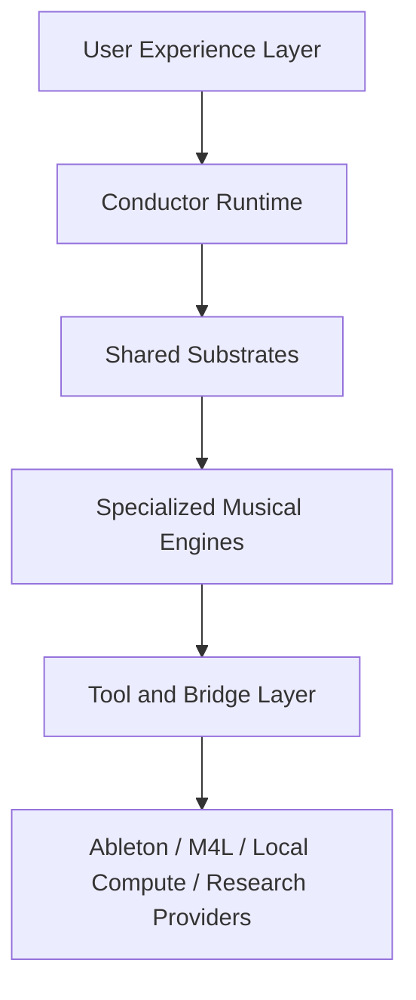

# LivePilot System Architecture v1

Status: proposal

Audience: product, runtime, MCP/server, agent, DSP/MIR, evaluation, memory, and workflow authors

Purpose: define the complete long-range system architecture for LivePilot beyond Agent OS v1 and Composition Engine v1.

This document answers a broader question than "how should one agent prompt behave?"

It defines:

- what the full LivePilot intelligence stack should become
- which subsystems should exist and why
- how those subsystems should cooperate
- how to keep the user experience simple while the internals become much more sophisticated
- how to sequence the work into something buildable

This is a system-design document, not a marketing document and not a vague brainstorm.

## Related Materials

This architecture builds directly on:

- [AGENT_OS_V1.md](./AGENT_OS_V1.md)
- [AGENT_OS_PHASE0_HARDENING_PLAN.md](./AGENT_OS_PHASE0_HARDENING_PLAN.md)
- [COMPOSITION_ENGINE_V1.md](./COMPOSITION_ENGINE_V1.md)
- [COMPOSITION_ENGINE_V1_INTEGRATION_PLAN.md](./COMPOSITION_ENGINE_V1_INTEGRATION_PLAN.md)
- [PROJECT_BRAIN_V1.md](./PROJECT_BRAIN_V1.md)
- [CAPABILITY_STATE_V1.md](./CAPABILITY_STATE_V1.md)
- [ACTION_LEDGER_V1.md](./ACTION_LEDGER_V1.md)
- [EVALUATION_FABRIC_V1.md](./EVALUATION_FABRIC_V1.md)
- [MEMORY_FABRIC_V2.md](./MEMORY_FABRIC_V2.md)
- [MIX_ENGINE_V1.md](./MIX_ENGINE_V1.md)
- [REFERENCE_ENGINE_V1.md](./REFERENCE_ENGINE_V1.md)
- [TASTE_MODEL_V1.md](./TASTE_MODEL_V1.md)
- [SOUND_DESIGN_ENGINE_V1.md](./SOUND_DESIGN_ENGINE_V1.md)
- [TRANSITION_ENGINE_V1.md](./TRANSITION_ENGINE_V1.md)
- [TRANSLATION_ENGINE_V1.md](./TRANSLATION_ENGINE_V1.md)
- [PERFORMANCE_ENGINE_V1.md](./PERFORMANCE_ENGINE_V1.md)
- [RESEARCH_ENGINE_V1.md](./RESEARCH_ENGINE_V1.md)
- [TOOL_REFERENCE.md](./TOOL_REFERENCE.md)
- [M4L_BRIDGE.md](./M4L_BRIDGE.md)
- [v2-master-spec/README.md](./v2-master-spec/README.md)
- [../livepilot/agents/livepilot-producer/AGENT.md](../livepilot/agents/livepilot-producer/AGENT.md)
- [../mcp_server/tools/agent_os.py](../mcp_server/tools/agent_os.py)
- [../mcp_server/tools/_agent_os_engine.py](../mcp_server/tools/_agent_os_engine.py)
- [../mcp_server/tools/analyzer.py](../mcp_server/tools/analyzer.py)
- [../mcp_server/tools/perception.py](../mcp_server/tools/perception.py)
- [../mcp_server/tools/automation.py](../mcp_server/tools/automation.py)
- [../mcp_server/tools/arrangement.py](../mcp_server/tools/arrangement.py)
- [../mcp_server/tools/theory.py](../mcp_server/tools/theory.py)
- [../mcp_server/tools/harmony.py](../mcp_server/tools/harmony.py)

This architecture is informed by:

- ReAct for interleaved reasoning and acting
- Reflexion for verbal feedback and episodic improvement
- Voyager for reusable skill accumulation
- tree-search agent work for selective branching on hard decisions
- music structure analysis, self-similarity, novelty segmentation, and descriptor systems from current MIR practice

It should be read together with the implementation-spec documents above. This architecture defines the long-range shape; the engine and substrate docs define the concrete module boundaries and delivery contracts.

## 1. North Star

LivePilot should eventually feel like a producer operating system inside Ableton Live.

The user should be able to say one sentence like:

- "make this arrangement more alive"
- "turn this loop into a proper verse"
- "make the mix hit harder without losing clarity"
- "make this synth feel more haunted and expensive"
- "push this toward a Four Tet / Burial crossover"
- "research the best move here and try the most tasteful version"

And the system should respond like a disciplined, highly musical collaborator that can:

- understand context
- inspect the session
- formulate a plan
- run small reversible experiments
- measure what changed
- learn what worked
- remember user taste
- research when needed
- avoid wrecking the session

The core product promise is:

- extremely simple outside
- deeply structured inside

## 2. Current Baseline

As of the current architecture direction, LivePilot already has strong primitives:

- a large deterministic MCP tool surface
- a Remote Script bridge into Ableton Live
- M4L Analyzer and FluCoMa-adjacent perception surfaces
- automation curve generation
- theory and harmony tools
- technique memory
- a first Agent OS loop for goal vectors, world model, critics, and evaluation
- a composition design direction

That is already a meaningful foundation.

But it is still missing the broader system integration that turns those parts into one coherent intelligence stack.

The major current gap is not "lack of tools." It is "lack of deep shared musical state and specialized engines built on top of it."

## 3. Architectural Principles

The full system should follow these principles.

### 3.1 One Conductor, Many Subsystems

LivePilot should not default to a swarm of independent agents.

It should use:

- one primary live `Conductor`
- a small number of structured internal subsystems
- selective branching/search only when justified

This keeps behavior:

- debuggable
- lower latency
- safer
- more coherent

### 3.2 Shared State Over Prompt Drift

System intelligence should live in:

- world models
- critics
- planners
- evaluators
- memory
- capability models

not mainly in ever-longer prompt prose.

### 3.3 Small Reversible Moves Beat Big Clever Moves

The default operating unit should be:

- one meaningful move
- one clear intent
- one evaluation cycle

This reduces:

- hidden damage
- attribution ambiguity
- user distrust

### 3.4 Use Multiple Kinds Of Evidence

The system should reason from:

- session topology
- symbolic note/harmony data
- sonic/perceptual descriptors
- automation state
- memory priors
- research findings
- user feedback

The system should never depend on only one evidence type.

### 3.5 Research Is Optional Enrichment, Not A Crutch

Open-web search must never be a hidden dependency for ordinary work.

The provider ladder should remain:

1. session-local evidence
2. local docs and architecture notes
3. memory and tactic cards
4. user-provided references
5. connected structured providers
6. open web search

### 3.6 Memory Should Store Outcomes

The system should remember:

- what worked
- in what context
- for which goal
- for which user
- and why it likely worked

not just saved chains or favorite devices.

### 3.7 Evaluation Is A First-Class Product Surface

The deeper the autonomy, the more critical evaluation becomes.

LivePilot should become meaningfully smarter by improving:

- evaluators
- critics
- state
- memory

more than by adding more free-form generation.

## 4. Layered System Model

The whole system can be understood as six layers.



### 4.1 User Experience Layer

This is the visible surface:

- natural-language creative direction
- concise progress explanations
- steering controls like "push harder" or "be more subtle"
- preview, keep, undo, and save interactions

### 4.2 Conductor Runtime

This is the main live agent loop:

- compile intent
- inspect world state
- invoke critics
- rank candidate moves
- execute
- evaluate
- keep/undo
- learn

### 4.3 Shared Substrates

These are reusable system services:

- Project Brain
- Capability Model
- Action Ledger
- Memory Fabric
- Research Fabric
- Evaluation Fabric
- Safety Kernel

### 4.4 Specialized Musical Engines

These are domain-specific intelligences:

- Agent OS Core
- Composition Engine
- Mix Engine
- Sound Design Engine
- Reference Engine
- Transition Engine
- Taste Model
- Translation Engine
- Performance Engine
- Research Engine

### 4.5 Tool and Bridge Layer

This is the deterministic action surface:

- MCP tools
- Remote Script
- analyzer and bridge calls
- perception functions
- memory store
- local docs

### 4.6 Environment Layer

This is where the system actually grounds itself:

- Ableton session state
- M4L analyzer
- audio captures
- local repo docs
- user references
- structured providers
- optional internet research

## 5. Conductor Runtime

The Conductor is the only subsystem that should own the session-level action loop.

### 5.1 Responsibilities

The Conductor should:

- interpret user intent
- decide which engines are relevant
- maintain global budgets
- choose execution scope
- arbitrate between conflicting engine recommendations
- own keep/undo decisions
- communicate with the user

### 5.2 Why One Conductor

One Conductor is better than many fully autonomous agents because:

- the session is one mutable shared environment
- action ordering matters
- undo logic needs a single owner
- capability state must stay coherent
- user trust drops when multiple invisible actors mutate the session at once

### 5.3 When To Branch

Branching or search should only be used when:

- there are multiple plausible candidate strategies
- one strategy is costly or hard to reverse
- the domain is inherently ambiguous
- a reference or style target is underdetermined
- deeper planning is worth the latency

Examples:

- reharmonization choices
- arrangement rewrites
- reference matching
- competing transition strategies
- unfamiliar plugin research

### 5.4 Runtime Modes

The Conductor should support:

- observe
- improve
- explore
- finish
- diagnose
- research
- research-augmented improve
- performance

These should be implemented as policy changes, not as entirely different agents.

### 5.5 Runtime Budgets

Every turn should maintain:

- latency budget
- risk budget
- novelty budget
- change budget
- undo budget
- research budget

This keeps the system from overcommitting.

## 6. Shared Substrates

The shared substrates are more important than any individual engine because they make the entire stack coherent.

## 6.1 Project Brain

`Project Brain` is the long-lived internal representation of the current project.

It should persist and update:

- session graph
- arrangement graph
- role graph
- device graph
- automation map
- style/taste context
- recent changes
- open hypotheses
- unresolved issues

It is the main answer to the question:

"What does LivePilot know about this project right now?"

### 6.1.1 Core Subgraphs

- `SessionGraph`: tracks, clips, devices, routing, returns, groups, scenes
- `ArrangementGraph`: sections, phrases, transitions, cue points, reveal states
- `RoleGraph`: musical jobs by track and by section
- `DeviceGraph`: devices, chains, health, controllability, macros
- `AutomationGraph`: existing envelopes, gesture density, conflict areas
- `ReferenceGraph`: active references and inferred target traits
- `IssueGraph`: current problems and opportunities

### 6.1.2 Requirements

Project Brain should be:

- incrementally updateable
- serializable
- inspectable
- debuggable
- partially cacheable

It should support both:

- session view work
- arrangement view work

## 6.2 Capability Model

The `Capability Model` tracks what the runtime can currently trust.

This should include:

- analyzer availability
- FluCoMa availability
- capture availability
- plugin health
- arrangement automation writability
- memory availability
- research provider availability
- reference availability
- latency-sensitive context

This is how the system avoids pretending it can do things it cannot actually do.

### 6.2.1 Output Shape

The capability model should be machine-usable:

```json
{
  "analyzer": {"available": true, "confidence": 0.95},
  "flucoma": {"available": false, "confidence": 1.0},
  "web_research": {"available": false, "confidence": 1.0},
  "arrangement_automation": {"available": "partial", "confidence": 0.55},
  "plugin_health": {"opaque_plugins": 2, "confidence": 0.88}
}
```

## 6.3 Action Ledger

The `Action Ledger` is the system's internal changelog and transaction log.

Every meaningful move should record:

- action id
- parent action
- engine owner
- intent
- affected scope
- before snapshot reference
- after snapshot reference
- evaluation result
- kept or undone
- user reaction if known

This enables:

- reliable undo chains
- postmortem debugging
- outcome memory creation
- benchmark replay

## 6.4 Memory Fabric

The `Memory Fabric` unifies several memory types.

### Core memory classes

- identity memory
- taste memory
- outcome memory
- technique cards
- style tactic cards
- anti-memory
- project-local memory

### Rules

- memory should bias plans, not dictate them
- memory must be context-tagged
- memory must store failures as well as successes
- memory retrieval should be scoped by project, goal, material type, and style

## 6.5 Research Fabric

The `Research Fabric` should unify:

- local docs
- user references
- structured providers
- optional web search
- tactic distillation

The output of research should always be:

- operational
- ranked
- provenance-aware
- evaluable in-session

## 6.6 Evaluation Fabric

This is the deepest infrastructure in the whole system.

The `Evaluation Fabric` should support:

- before/after snapshot normalization
- fast online evaluation
- deeper offline evaluation
- engine-specific scoring
- keep/undo policy
- benchmark logging

### Evaluation types

- sonic evaluation
- composition evaluation
- transition evaluation
- reference-gap evaluation
- taste-fit evaluation
- translation evaluation

### Design rule

Evaluation should never be hidden inside one prompt response.

It should be explicit system state.

## 6.7 Safety Kernel

The `Safety Kernel` is the policy layer that prevents avoidable mistakes.

It should enforce:

- no blind writes
- no unsupported action claims
- no silent fallback
- no irreversible bulk changes by default
- no overwriting automation without inspection
- no high-cost research loops without reason
- no destructive transitions between unrelated action scopes

## 7. Specialized Engines

These engines are where LivePilot becomes truly differentiated.

They all share the Conductor, Project Brain, Evaluation Fabric, and Memory Fabric.

## 7.1 Engine Overview

| Engine | Primary Question | Main Inputs | Main Outputs |
|---|---|---|---|
| Agent OS Core | How should the overall loop operate? | user goals, world state, capability state | plans, budgets, keep/undo logic |
| Composition Engine | What should happen musically over time? | notes, harmony, phrases, sections, novelty, automation | arrangement moves, phrase moves, gesture plans |
| Mix Engine | What sounds weak, masked, flat, or unbalanced? | spectrum, loudness, routing, devices, roles | mix moves, balance corrections, space/depth plans |
| Sound Design Engine | How should this timbre behave and evolve? | patch/device state, timbral goals, modulation state | patch changes, layer plans, macro gestures |
| Reference Engine | How far are we from the target and what matters? | current project, references, style tactics | gap reports, ranked moves |
| Transition Engine | How do we make arrivals and exits feel earned? | section graph, phrase graph, gesture map | transition plans, pre-impact moves, handoffs |
| Taste Model | What does this user reliably prefer or dislike? | accepted outcomes, rejections, projects | ranking priors, guardrails, style fit |
| Translation Engine | Will this survive other playback environments? | loudness, low-end, mono behavior, references | translation warnings and fixes |
| Performance Engine | How should LivePilot behave in live or improvisational use? | scenes, macros, cue points, performance mode | scene-level moves, safe performance actions |
| Research Engine | What knowledge is missing and where do we get it? | capability state, references, docs, web | tactic cards, ranked evidence |

## 8. Agent OS Core

Agent OS Core remains the operating layer.

It should eventually own:

- goal compilation
- mode selection
- world model orchestration
- critic invocation
- planning policy
- evaluator invocation
- memory write policy
- research mode switching

### 8.1 What Agent OS Should Not Own

It should not become a bloated monolith that directly contains:

- arrangement heuristics
- mix heuristics
- patch-design heuristics
- reference-delta logic

Those belong in specialized engines.

## 9. Composition Engine

Composition Engine should own musical time, role, phrase, motif, harmony, and gesture.

This is already described more fully in [COMPOSITION_ENGINE_V1.md](./COMPOSITION_ENGINE_V1.md).

Its long-range responsibilities are:

- section inference
- phrase analysis
- role inference
- motif tracking
- harmony field analysis
- tension modeling
- contrast modeling
- automation-as-gesture authoring

### 9.1 Why It Matters

Without this layer, LivePilot can still become a strong mix assistant.

With it, LivePilot becomes a serious co-creator.

## 10. Mix Engine

The `Mix Engine` should be the next major engine after composition.

### 10.1 Mission

Turn fuzzy user goals like:

- cleaner
- wider
- more glued
- more expensive
- harder
- more club-ready
- less muddy

into:

- explicit mix hypotheses
- ranked corrective or enhancing moves
- validated before/after decisions

### 10.2 Internal Representations

Mix Engine should maintain:

- `BalanceState`
- `MaskingMap`
- `DepthMap`
- `BusGraph`
- `TranslationState`
- `DynamicsState`
- `StereoState`

### 10.3 Critics

Mix Engine should eventually include:

- balance critic
- masking critic
- dynamics critic
- stereo/depth critic
- bus glue critic
- translation critic
- harshness/mud critic
- headroom critic

### 10.4 Action Classes

- EQ correction
- dynamic correction
- bus routing refinement
- width/depth shaping
- transient shaping
- send design
- bus compression and saturation
- mono-center stabilization

### 10.5 Evaluation

Mix Engine should score:

- masking reduction
- headroom health
- perceived punch
- low-end stability
- stereo coherence
- translation safety
- preservation of identity

## 11. Sound Design Engine

The `Sound Design Engine` should own timbral intelligence.

### 11.1 Mission

Turn requests like:

- darker
- more haunted
- glassier
- more unstable
- wider but still centered
- more analog
- more expensive
- more tactile

into patch-level and layer-level strategies.

### 11.2 Internal Representations

The engine should maintain:

- `PatchModel`
- `ModulationState`
- `LayerStrategy`
- `MacroMap`
- `TimbreDescriptorState`
- `PluginConfidenceState`

### 11.3 Responsibilities

- patch inspection
- timbral goal translation
- macro/modulation planning
- layer strategy
- timbral contrast design
- plugin-specific tactic use

### 11.4 Why This Needs Its Own Engine

Timbral intelligence is not the same as mix intelligence.

It needs different:

- representations
- critics
- research cards
- evaluation metrics

## 12. Reference Engine

The `Reference Engine` should become one of the most important user-facing engines.

### 12.1 Mission

Translate one or more references into actionable gap analysis.

This should work for:

- audio references
- artist/style references
- project-internal references
- section-specific references

### 12.2 What It Should Compare

- spectrum and loudness contour
- density arc
- section pacing
- reveal schedule
- transition behavior
- harmonic language
- automation boldness
- width/depth usage
- motif density and development

### 12.3 Key Design Rule

Reference Engine should not be a style-matching copier.

It should be a:

- structured difference detector
- relevance filter
- move recommender

### 12.4 Outputs

- gap report
- ranked move suggestions
- style tactic cards
- engine routing hints

## 13. Transition Engine

The `Transition Engine` may start inside Composition Engine, but it is strong enough to justify its own boundary later.

### 13.1 Mission

Own:

- arrivals
- exits
- handoffs
- pre-impact subtraction
- re-entry choreography
- fills
- tails and carryovers
- FX punctuation

### 13.2 Why A Separate Engine May Be Worth It

Transitions combine:

- composition
- arrangement
- automation
- mix
- timing
- emotion

They are one of the clearest markers of professional production.

### 13.3 Core Representations

- `BoundaryMap`
- `ArrivalStrengthState`
- `PreImpactState`
- `TailCarryState`
- `HandoffGraph`

## 14. Taste Model

The `Taste Model` is what turns LivePilot from smart to personal.

### 14.1 Mission

Learn:

- how bold the user likes changes
- how dense they like sections
- how obvious or subtle they like transitions
- how much automation motion feels right to them
- what harmonic colors they prefer
- which devices and tactics they repeatedly like or dislike

### 14.2 Inputs

- accepted changes
- undone changes
- ratings or explicit feedback
- repeated project patterns
- style references the user selects

### 14.3 Outputs

- candidate ranking priors
- hard guardrails
- anti-pattern flags
- personalization for engine decisions

### 14.4 Anti-Memory

Taste Model must explicitly retain dislikes.

This is as important as positive preferences.

## 15. Translation Engine

The `Translation Engine` should own playback robustness.

### 15.1 Mission

Help the user answer:

- Will this hold up in mono?
- Will the low end collapse on small speakers?
- Is the midrange too buried?
- Is the top end harsh outside the studio?
- Is the chorus exciting only because it is loud?

### 15.2 Subsystems

- mono compatibility critic
- low-end translation critic
- vocal/front-element presence critic
- harshness critic
- loudness posture critic
- headphone/small speaker proxy critic

### 15.3 Design Rule

This is not "AI mastering" in the shallow one-click sense.

It is translation intelligence and final-stage critique.

## 16. Performance Engine

The `Performance Engine` should govern live and improvisational behavior.

### 16.1 Mission

Make LivePilot useful in:

- scene-based performance
- live arrangement mutation
- set pacing
- macro and controller-safe moves
- DJ-like or hybrid-live environments

### 16.2 Constraints

Performance mode should obey:

- stricter latency budgets
- stricter safety rules
- fewer destructive or long-running actions
- more macro-level and scene-level moves

### 16.3 Why It Matters

This is one place LivePilot can become uniquely Ableton-native instead of just a generic DAW assistant.

## 17. Research Engine

The `Research Engine` is how the system expands beyond what is already known locally.

### 17.1 Mission

Find missing knowledge, distill it, and turn it into operational tactics.

### 17.2 Core Outputs

- plugin tactic cards
- style tactic cards
- failure warnings
- ranked external techniques
- provenance-aware evidence summaries

### 17.3 Design Rule

Research should not write directly into the session.

It should produce candidate moves for the Conductor to test.

## 18. Data Contracts

These are not final code contracts, but they define the shape of the architecture.

### 18.1 ProjectState

```json
{
  "project_id": "proj_current",
  "session_graph": {},
  "arrangement_graph": {},
  "role_graph": {},
  "device_graph": {},
  "automation_graph": {},
  "capability_state": {},
  "active_references": [],
  "open_issues": [],
  "recent_actions": []
}
```

### 18.2 ActionProposal

```json
{
  "action_id": "act_023",
  "engine": "mix",
  "scope": "drum_bus",
  "intent": "increase punch without harming clarity",
  "risk": 0.22,
  "reversible": true,
  "preconditions": ["analyzer_available"],
  "verification_plan": ["spectrum", "rms", "crest", "user_audition"]
}
```

### 18.3 EvaluationRecord

```json
{
  "action_id": "act_023",
  "before_snapshot_id": "snap_0011",
  "after_snapshot_id": "snap_0012",
  "engine_scores": {
    "mix": 0.71,
    "taste_fit": 0.66
  },
  "goal_progress": 0.63,
  "collateral_damage": 0.08,
  "keep_change": true,
  "notes": ["punch improved", "clarity preserved"]
}
```

### 18.4 TacticCard

```json
{
  "card_id": "tactic_haunted_transition_01",
  "type": "style_tactic",
  "style": "burial_adjacent",
  "problem": "flat section boundary",
  "method": "subtraction plus ghost tail carry-over",
  "best_engines": ["transition", "composition"],
  "risks": ["too obvious if overused"],
  "evidence": {
    "provider_types": ["memory", "user_reference"],
    "source_count": 2
  }
}
```

### 18.5 TasteProfile

```json
{
  "user_id": "local_user",
  "transition_boldness": 0.38,
  "automation_density_preference": 0.42,
  "harmony_boldness": 0.57,
  "density_tolerance": 0.61,
  "favorite_device_families": ["ableton_native", "valhalla"],
  "disliked_patterns": ["obvious_risers", "overwide_drops"]
}
```

## 19. Model Strategy

This system should not assume one model is best for every job.

### 19.1 Recommended Runtime Topology

- one primary high-quality Conductor model
- lightweight critic or classification helpers where latency matters
- selective use of deeper reasoning for hard planning or research synthesis

### 19.2 Principles

- keep session mutation under the Conductor
- use smaller helpers for bounded inference, not for independent action ownership
- branch only when expected value exceeds latency cost
- prefer persistent state over repeated giant-context prompting

### 19.3 Why Not A Full Swarm

Many-agent systems often fail by:

- duplicating work
- racing on shared state
- hiding decision provenance
- increasing latency
- weakening trust

LivePilot's domain is too stateful and too safety-sensitive for that as the default model.

## 20. Repository Module Boundaries

The current repo already hints at some of these boundaries.

### 20.1 Existing Strong Foundations

- `mcp_server/tools/agent_os.py`
- `mcp_server/tools/_agent_os_engine.py`
- `mcp_server/tools/analyzer.py`
- `mcp_server/tools/perception.py`
- `mcp_server/tools/automation.py`
- `mcp_server/tools/arrangement.py`
- `mcp_server/tools/theory.py`
- `mcp_server/tools/harmony.py`
- `mcp_server/memory/`

### 20.2 Likely Future Modules

Shared substrates:

- `project_brain/`
- `capabilities/`
- `evaluation/`
- `research/`
- `ledger/`

Engines:

- `composition/`
- `mix_engine/`
- `sound_design/`
- `reference_engine/`
- `transition_engine/`
- `taste_model/`
- `translation_engine/`
- `performance_engine/`

### 20.3 Prompt Layer

The prompt layer should eventually become thinner and more policy-like.

It should explain:

- how to use the architecture
- how to choose scopes and budgets
- how to report to the user

It should not carry the entire system intelligence alone.

## 21. Evaluation And Telemetry

If this system becomes more complex without a stronger evaluation story, it will become harder to trust.

### 21.1 Online Telemetry

Track:

- keep rate
- undo rate
- regret rate
- time to first acceptable move
- total turn count to satisfaction
- research usefulness rate
- taste-hit rate
- average action scope size

### 21.2 Offline Benchmarks

Create scenario suites for:

- mix improvements
- loop-to-section arrangement
- harmonic development
- transition strengthening
- reference alignment
- sound design adaptation
- translation checking

### 21.3 Human Review

Eventually add blind pairwise or A/B review for:

- musicality
- subtlety
- taste alignment
- usefulness

### 21.4 Architecture Rule

No engine should be considered "done" unless it has:

- scenario tests
- telemetry hooks
- at least one engine-specific acceptance metric

## 22. Recommended Build Order

This is the architecture-level order, not the detailed roadmap.

1. harden Agent OS phase 1
2. build Project Brain and shared substrates
3. bring Composition Engine to phase 1 implementation
4. build Mix Engine phase 1
5. add Taste Model
6. build Reference Engine
7. build Sound Design Engine
8. deepen Transition Engine
9. build Translation Engine
10. build Performance Engine
11. expand Research Engine
12. mature eval harness and telemetry continuously

## 23. Success Conditions

The full architecture is working when:

- users can express high-level creative goals in one sentence
- the system chooses smaller, smarter moves more often
- kept changes increasingly outperform undone changes
- the system becomes more personal over time
- research produces reusable tactics
- different engines share one coherent world model
- LivePilot feels more like a disciplined collaborator than a collection of tools

## 24. Summary

The most powerful future version of LivePilot is not:

- a larger prompt
- a longer tool list
- a swarm of half-coordinated agents

It is:

- one Conductor
- strong shared substrates
- specialized musical engines
- real evaluators
- real memory
- capability-aware research
- explicit safety

Agent OS gives LivePilot an operating loop.

Composition Engine gives it musical time intelligence.

The broader system architecture described here is what turns those beginnings into a complete producer operating system.

## 25. External References

These sources are relevant design influences, not strict implementation dependencies:

- ReAct: [arXiv:2210.03629](https://arxiv.org/abs/2210.03629)
- Reflexion: [arXiv:2303.11366](https://arxiv.org/abs/2303.11366)
- Voyager: [arXiv:2305.16291](https://arxiv.org/abs/2305.16291)
- Language Agent Tree Search: [arXiv:2310.04406](https://arxiv.org/abs/2310.04406)
- Barwise Music Structure Analysis / CBM: [arXiv:2311.18604](https://arxiv.org/abs/2311.18604)
- librosa recurrence matrices: [docs](https://librosa.org/doc/main/generated/librosa.segment.recurrence_matrix.html)
- Essentia algorithms overview: [docs](https://essentia.upf.edu/api/docs/tutorial/algorithms/)
- FluCoMa NoveltySlice: [docs](https://learn.flucoma.org/reference/noveltyslice/)
