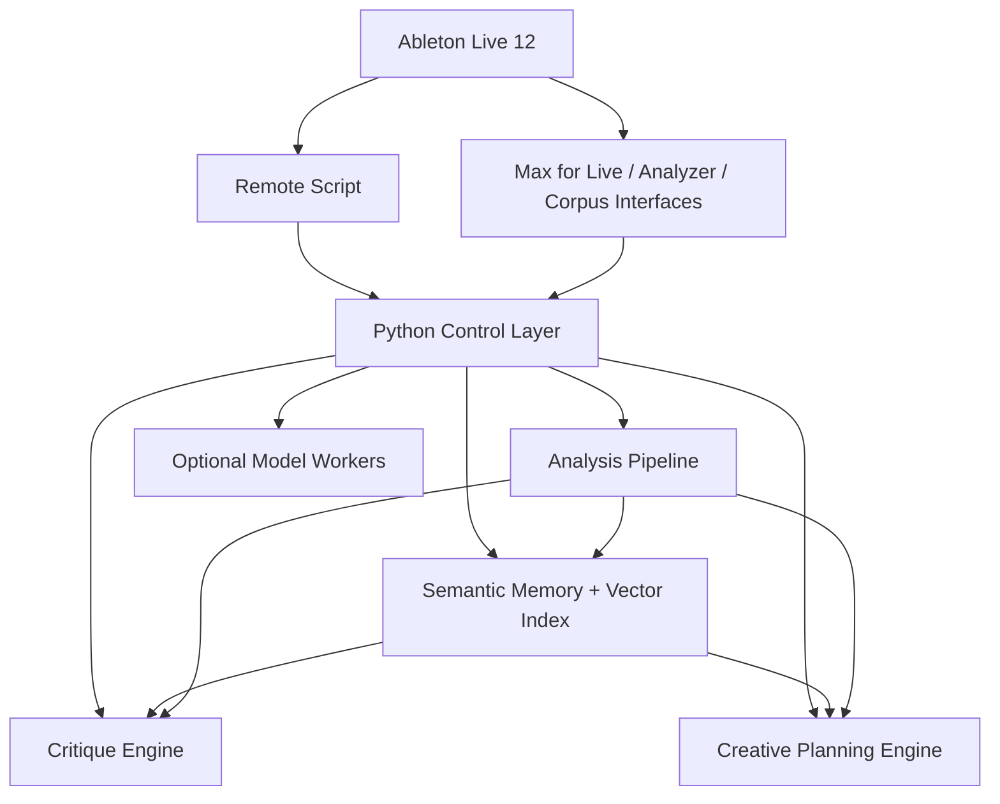

# LivePilot V2

## Technical Implementation Spec + Prioritized Execution Plan

**Author:** Codex  
**Date:** 2026-03-27  
**Companion document:** [2026-03-27-v2-deep-research-roadmap.md](./2026-03-27-v2-deep-research-roadmap.md)

---

## 1. Purpose

This document turns the high-level V2 critique into a practical build plan.

It is a combination of:

- a technical implementation spec
- a brutally prioritized execution plan

It is written to answer:

- what V2 should actually be
- which modules should exist
- where each responsibility should live
- what data needs to be stored
- what should be built first
- what should be explicitly deferred
- how to measure whether V2 is becoming genuinely better, not just larger

---

## 2. Product Thesis

### Core thesis

LivePilot V2 should become:

**a research-grade musical intelligence layer for editable Ableton sessions**

That means:

- keep Live as the editable host
- keep deterministic session control as the base
- deepen listening, retrieval, critique, and co-creation
- avoid turning the product into a tool-count warehouse

### What V2 is not

V2 is not primarily:

- a prompt-to-song generator
- a giant collection of one-off low-level endpoints
- a theory-demo product
- a static markdown knowledge library with an AI wrapper

### What V2 is

V2 is a system that should:

- operate Live safely
- hear music on multiple timescales
- retrieve sounds, chains, and prior work semantically
- critique current material meaningfully
- generate constrained musical options
- support research, composition, production, and performance

### Release framing

The V2 vision should be implemented as staged releases, not as one monolithic
delivery.

- `V2.0`: listening foundation
- `V2.1`: thin retrieval foundation
- `V2.2`: critique engine
- `V2.x`: corpus workflows, variation, and broader co-creative systems
- `V3 / R&D`: performer-mode co-agency

The most important practical consequence is scope:

- V2.0 should mean listening plus snapshots plus section/reference analysis
- retrieval should start small and descriptor-first
- critique should be the next identity-changing release
- performer mode is not part of the core committed V2 path

---

## 3. Top-Level Priorities

These are the only priorities that matter for V2.

### Priority A: Hearing

The system must hear better before it can think better.

### Priority B: Retrieval

The system must be able to find relevant prior sounds, chains, references, and outcomes.

### Priority C: Critique

The system must explain what is wrong, flat, weak, crowded, static, or mismatched.

### Priority D: Variation

The system must propose useful alternatives, not just edits or novelty.

### Priority E: Co-agency

The system must behave intelligibly in live and iterative creative contexts.

---

## 4. Non-Goals For V2

These are important because scope control will determine whether V2 gets sharper or bloated.

### Explicit non-goals

- Adding dozens of new low-level control tools unless they unblock a higher-level workflow
- Building a fully general DAW abstraction across other hosts
- Shipping a giant proprietary audio generation model as the product center
- Replacing the user’s artistic decision-making
- Solving universal music intelligence before solving practical, session-native workflows

### Deferred unless strong evidence appears

- Large-scale prompt-to-audio generation
- Full automatic mastering claims
- Giant symbolic composition taxonomies
- Overly broad social or collaborative cloud features
- Universal marketplace-scale device knowledge beyond the user’s real library

---

## 5. V2 Product Modes

V2 should be organized internally and conceptually around 4 modes.

### 5.1 Lab Mode

Purpose:

- sound research
- descriptor analysis
- corpus exploration
- sonic similarity
- timbre studies

Primary outputs:

- maps
- clusters
- retrieval sets
- comparison reports
- transformation ideas

### 5.2 Composer Mode

Purpose:

- continuation
- variation
- arrangement development
- phrase-level generation
- role-aware composition

Primary outputs:

- candidate continuations
- section plans
- related loop families
- constrained alternatives

### 5.3 Producer Mode

Purpose:

- device choice
- chain building
- transition design
- mix critique
- reference matching

Primary outputs:

- diagnosis
- recommended moves
- auditionable chain options
- before/after comparisons

### 5.4 Performer Mode

Purpose:

- live co-agency
- installation behavior
- cue-driven transitions
- adaptive response

Primary outputs:

- constrained actions
- performance-safe state changes
- live summaries
- confidence-bounded behavior

Note:

- Performer Mode remains part of the long-term product model
- it should be treated as `V3 / R&D` unless radically narrowed

---

## 6. System Architecture

### 6.1 Architecture principle

Keep the current overall structure, but add two major intelligence layers:

- a Listening and Retrieval layer
- a Critique and Creative Planning layer

### 6.2 Target architecture



### 6.3 Boundary rules

#### Remote Script responsibilities

Keep only tasks that must happen inside Ableton:

- read/write Live state
- clips, notes, arrangement, devices, browser, automation
- safe main-thread command execution
- low-latency operational state access

#### Max for Live responsibilities

Use Max where it is strongest:

- real-time audio feature extraction
- interactive descriptor/corpus interfaces
- gesture and performance signal handling
- artistic patching and visualization
- FluCoMa workflows

#### Python responsibilities

Python should become the real intelligence hub:

- offline MIR analysis
- similarity indexing and optional embedding support
- similarity retrieval
- memory persistence
- critique generation
- planning
- orchestration

#### Model worker responsibilities

Separate optional workers for heavier model-based tasks:

- audio embeddings
- symbolic continuation
- text-guided FX search
- timbre transfer
- neural audio experiments

These workers should never destabilize the control plane.

---

## 7. Proposed Module Layout

This is a recommended V2 structure, not a mandatory exact tree.

```text
livepilot_v2/
  control/
    ableton_connection.py
    remote_commands.py
    session_snapshot.py
  analysis/
    backends/
      base.py
      librosa_backend.py
      essentia_backend.py
    offline_audio/
      descriptors.py
      rhythm.py
      tonal.py
      segmentation.py
      mix.py
    realtime/
      spectral_stream.py
      event_features.py
      state_fusion.py
    embeddings/
      audio_embedder.py
      text_audio.py
  memory/
    store.py
    schemas.py
    outcomes.py
    preferences.py
    embedding_backend.py
  retrieval/
    similarity_store.py
    nearest_neighbors.py
    hybrid_search.py
    corpus_builder.py
    corpus_queries.py
  critique/
    reference_compare.py
    stagnation.py
    masking.py
    arrangement_diagnostics.py
    chain_eval.py
  compose/
    continuation.py
    variation.py
    role_planner.py
    section_planner.py
    constraints.py
  performance/
    behavior_modes.py
    cue_engine.py
    safety.py
    coagency_state.py
  interfaces/
    mcp_tools/
      tool_registry.py
    skills/
      workflow_guides.md
      decision_loops.md
    max_messages/
    reports/
```

---

## 8. Data Contracts

V2 needs much stronger structured data. The biggest mistake would be trying to solve this with prose alone.

### 8.1 SessionAnalysisSnapshot

Purpose:

- capture the musical and sonic state of a session region at a point in time

```json
{
  "snapshot_id": "uuid",
  "created_at": "2026-03-27T03:00:00Z",
  "scope": {
    "type": "clip | section | full_mix | stem",
    "track_indices": [0, 1, 2],
    "time_range_beats": [32.0, 64.0]
  },
  "transport": {
    "tempo": 124.0,
    "time_signature": [4, 4]
  },
  "descriptors": {
    "loudness": {
      "integrated_lufs": -11.8,
      "momentary_curve": []
    },
    "spectral": {
      "centroid_mean": 2150.0,
      "flatness_mean": 0.12,
      "rolloff_mean": 7800.0
    },
    "rhythm": {
      "tempo_confidence": 0.93,
      "swing_estimate": 0.18,
      "onset_rate": 5.1,
      "density_curve": []
    },
    "tonal": {
      "key": "C minor",
      "key_confidence": 0.71,
      "chord_summary": []
    },
    "structure": {
      "novelty_curve": [],
      "segment_boundaries": []
    }
  },
  "embedding_refs": {
    "audio": "optional_embedding_id_1",
    "section": "optional_embedding_id_2"
  }
}
```

### 8.2 AudioAssetRecord

Purpose:

- index samples, renders, stems, field recordings, corpus entries

```json
{
  "asset_id": "uuid",
  "source_path": "/absolute/path.wav",
  "kind": "sample | render | stem | field_recording | reference",
  "duration_seconds": 12.438,
  "sample_rate": 48000,
  "channels": 2,
  "tags": ["metal", "scrape", "dark"],
  "descriptors": {
    "brightness": 0.42,
    "roughness": 0.68,
    "harmonicity": 0.21,
    "attack_sharpness": 0.73
  },
  "embedding_refs": {
    "audio": "optional_embedding_uuid"
  },
  "analysis_refs": {
    "segments": [],
    "nearest_neighbors": []
  }
}
```

### 8.3 TechniqueRecordV2

This extends the current memory concept.

```json
{
  "id": "uuid",
  "name": "Dusty sidechain-pulse pad chain",
  "type": "device_chain",
  "created_at": "2026-03-27T03:10:00Z",
  "updated_at": "2026-03-27T03:10:00Z",
  "tags": ["pad", "ducking", "dusty"],
  "qualities": {
    "summary": "Soft pad chain with inhaling sidechain rhythm and smeared top end.",
    "mood": ["soft", "nostalgic", "breathing"],
    "sonic_texture": "dusty, blurred, gently pumping"
  },
  "payload": {
    "devices": [],
    "track_type": "midi"
  },
  "perceptual_profile": {
    "descriptor_summary": {
      "brightness": 0.31,
      "motion": 0.57,
      "width": 0.74
    },
    "embedding_refs": {
      "audio_demo": "optional_embedding_uuid"
    }
  },
  "usage_history": {
    "replay_count": 4,
    "accepted_count": 3,
    "rejected_count": 1
  },
  "context_history": [
    {
      "task_type": "breakdown_pad",
      "material_type": "sustained_chords",
      "result": "accepted"
    }
  ]
}
```

### 8.4 CritiqueReport

Purpose:

- standardize all diagnosis outputs

```json
{
  "report_id": "uuid",
  "created_at": "2026-03-27T03:20:00Z",
  "scope": {
    "track_indices": [0, 1, 2, 3],
    "time_range_beats": [64.0, 96.0]
  },
  "diagnosis_type": "reference_compare | stagnation | masking | transition | arrangement",
  "summary": "The drop does not feel larger because low-mid density rises, but attack and width do not meaningfully increase.",
  "confidence": 0.78,
  "findings": [
    {
      "label": "Insufficient attack contrast",
      "evidence": "high-mid transient energy only rises 3%",
      "severity": "medium"
    }
  ],
  "recommended_moves": [
    {
      "type": "mix_move",
      "action": "increase transient definition on drums in the first 8 beats of the drop"
    },
    {
      "type": "arrangement_move",
      "action": "thin pre-drop low-mid pad energy before the downbeat"
    }
  ]
}
```

### 8.5 WorkflowOutcome

Purpose:

- learn what actually helped

```json
{
  "outcome_id": "uuid",
  "timestamp": "2026-03-27T03:25:00Z",
  "workflow_type": "reference_fix | variation_family | corpus_search",
  "input_refs": {
    "session_snapshot_id": "uuid",
    "technique_ids": ["uuid1"]
  },
  "actions_taken": [
    "loaded_chain",
    "adjusted_filter",
    "printed_variation_2"
  ],
  "user_response": {
    "accepted": true,
    "favorite": false,
    "notes": "closer, but still slightly too smeared"
  }
}
```

---

## 9. Storage Strategy

### 9.1 Minimum storage components

V2 should maintain:

- relational metadata store
- JSON document store for rich payloads
- file-backed analysis cache
- local similarity artifacts for retrieval

Optional later:

- embedding store
- vector or ANN index if corpus scale actually requires it

### 9.2 Suggested approach

#### Option A: SQLite + JSON + local similarity layer

Recommended for V2.

Use:

- SQLite for metadata and relationships
- JSON blobs for flexible payloads
- persisted descriptor arrays or similarity features for retrieval
- optional embedding caches behind an abstraction layer

Advantages:

- local-first
- easy to back up
- no cloud dependency
- good enough at V2 scale
- does not overcommit the project to retrieval infrastructure too early

### 9.3 What should be cached

- clip-level analysis snapshots
- exported preview renders
- optional embeddings
- nearest-neighbor results
- critique reports

---

## 10. Tooling Strategy

### 10.1 Rule for new tools

Do not add a new MCP tool unless it satisfies at least one of these:

- it is required by a new high-level workflow
- it removes a large amount of agent orchestration complexity
- it supports a mode-specific user experience

### 10.2 Shift the balance

V1 emphasis:

- low-level callable operations

V2 emphasis:

- higher-level workflow tools

### 10.3 Tool Surface Evolution

The V2 workflow shift must coexist with the already shipped V1 primitive tool
surface.

That requires an explicit migration policy:

- keep existing primitive tools stable during V2
- introduce workflow tools as the recommended surface
- classify current tools as `keep`, `workflow_wrapped`, `internal_only`, or
  `future_deprecate`
- document when a workflow tool supersedes a primitive sequence
- avoid removing or hiding primitives until workflow adoption is proven

This should be reflected both in MCP registration structure and in user-facing
docs.

### 10.4 Agent Skill Evolution

The V2 shift is not complete if only the tool registry changes.

Agent-facing guidance also needs to evolve so the model learns when to use the
new workflows and when to fall back to low-level primitives.

That guidance should:

- teach the `Hear -> Diagnose -> Propose -> Act -> Audition -> Learn` loop
- prefer high-level workflow tools before primitive multi-step sequences
- preserve primitive fallback patterns for advanced control and compatibility
- be updated alongside new workflow tool releases, not after them

### 10.5 Recommended V2 tool families

#### Analysis tools

- `analyze_section`
- `analyze_groove`
- `analyze_transition`
- `analyze_reference_delta`

#### Retrieval tools

- `find_similar_audio`
- `find_similar_section`
- `find_related_chains`
- `search_corpus_by_example`

#### Critique tools

- `critique_mix_section`
- `diagnose_stagnation`
- `diagnose_masking`
- `critique_arrangement_arc`

#### Creative workflow tools

- `propose_variation_family`
- `continue_phrase`
- `plan_section_development`
- `suggest_chain_ladder`

#### Performance tools

- `set_behavior_mode`
- `get_coagency_state`
- `apply_cue_transition`
- `panic_freeze`

### 10.6 Tools to avoid unless proven necessary

- overly fine-grained descriptors as standalone tools
- one-tool-per-theoretical-transformation expansion
- duplicate wrappers for operations the agent can already orchestrate cleanly

---

## 11. Testing Strategy

V2 will need more than unit tests.

### 11.1 Test layers

#### Layer 1: Contract tests

- tool registration
- input validation
- schema stability

#### Layer 2: Logic tests

- descriptor calculations
- retrieval ranking behavior
- critique logic
- constraint handling

#### Layer 3: Golden-file tests

- expected analysis outputs for canonical audio clips
- expected critique reports for known before/after pairs

#### Layer 4: Integration tests

- mock Ableton session operations
- corpus indexing pipeline
- memory persistence and retrieval

#### Layer 5: Human eval loops

- usefulness of critique
- usefulness of variations
- retrieval quality
- perceptual alignment

### 11.2 Test datasets to prepare

- drum loops
- harmonic loops
- stems
- references
- field recordings
- edge-case noisy material

---

## 12. Phase Plan

This is the brutally prioritized part.

## Phase 0: Refactor And Narrow

### Goal

Create room for V2 without drowning in surface area.

### Must do

- freeze low-value tool expansion
- group current tools by workflow
- identify redundant or low-ROI endpoints
- create internal module boundaries for analysis, memory, retrieval, critique

### Nice to do

- add telemetry on which tools/workflows are actually used

### Deliverables

- V2 architecture skeleton
- tool inventory categorized by actual workflow value
- a "do not expand without evidence" rule

### Exit criteria

- V2 is no longer being described primarily by total tool count

### Defer

- new compositional systems
- new neural modules
- corpus UI

---

## Phase 1: Listening Foundation

### Goal

Give LivePilot better ears.

### Must build

- offline audio analysis pipeline
- section-level analysis snapshots
- richer rhythm, tonal, and structural descriptors
- analysis cache keyed by source and settings

### Suggested concrete modules

- `analysis/offline_audio/descriptors.py`
- `analysis/offline_audio/rhythm.py`
- `analysis/offline_audio/segmentation.py`
- `analysis/offline_audio/mix.py`

### Dependencies

- pluggable analysis backend
- stable file-analysis job pipeline
- snapshot schema

### Backend rule

- start with a low-friction default backend
- use `librosa` as the default backend for the initial V2.0 release
- support Essentia as an optional higher-power backend, not a hard requirement
- degrade gracefully when optional backends are unavailable
- do not let analysis install complexity become the defining V2.0 problem

### First MCP workflows to expose

- `analyze_section`
- `analyze_reference_delta`
- `analyze_groove`

### Exit criteria

- the system can explain differences between two sections in musically useful language

### Defer

- fancy visual corpus maps
- neural timbre work

---

## Phase 2: Thin Retrieval Foundation

### Goal

Make prior work searchable in a simple, useful way before building heavy
retrieval infrastructure.

### Must build

- memory schema V2
- audio asset catalog
- descriptor-backed local similarity
- thin hybrid search
- outcome logging
- optional embedding backend abstraction

### Suggested concrete modules

- `memory/schemas.py`
- `memory/embedding_backend.py`
- `retrieval/similarity_store.py`
- `retrieval/nearest_neighbors.py`
- `retrieval/hybrid_search.py`

### Key design rule

Use hybrid ranking:

- tags
- descriptors
- usage outcomes

Embeddings are optional in this phase.
They are not a gate for retrieval usefulness.

### First MCP workflows to expose

- `find_similar_audio`
- `find_similar_section`
- `find_related_chains`

### Exit criteria

- a user can retrieve useful sonic neighbors or prior chains with good relevance

### Defer

- full text-guided semantic retrieval
- vector-database complexity
- giant automatic corpus interfaces
- complex live behavior logic

---

## Phase 3: Critique Engine

### Goal

Move from operator to evaluator.

### Must build

- critique report schema
- reference comparison engine
- stagnation detector
- masking heuristics
- section contrast diagnostics

### Suggested concrete modules

- `critique/reference_compare.py`
- `critique/stagnation.py`
- `critique/masking.py`
- `critique/arrangement_diagnostics.py`

### First MCP workflows to expose

- `critique_mix_section`
- `diagnose_stagnation`
- `critique_arrangement_arc`

### Exit criteria

- the system can produce critiques that a real producer would recognize as credible

### Defer

- full autonomous mixing
- one-click “fix everything” behaviors

---

## Phase 4: Corpus Lab

### Goal

Turn LivePilot into a genuine sound research tool.

### Must build

- corpus ingestion pipeline
- corpus item schema
- segmentation and slicing pipeline
- nearest-neighbor and cluster views
- preview/load workflows back into Live

### Suggested concrete modules

- `retrieval/corpus_builder.py`
- `retrieval/corpus_queries.py`
- Max-side FluCoMa support patches

### Recommended UX

- text query
- by-example query
- descriptor sliders
- “more like this / less like this” ranking

### Exit criteria

- users can explore personal sound archives as structured sonic terrain

### Defer

- cloud-scale corpus sharing
- heavy collaborative features

---

## Phase 5: Mixed-Initiative Composition

### Goal

Build useful musical variation and continuation, not novelty features.

### Must build

- continuation under constraint
- variation family generator
- role-aware planning
- section development planner

### Suggested concrete modules

- `compose/continuation.py`
- `compose/variation.py`
- `compose/role_planner.py`
- `compose/section_planner.py`

### Design rule

Every generative system must support:

- preserve identity
- change one dimension at a time
- produce ranked options
- explain the change

### Exit criteria

- users routinely accept or adapt generated options in real sessions

### Defer

- broad symbolic theory expansion
- exotic generators with unclear workflows

---

## Phase 6: Timbre Intelligence + Neural Modules

### Goal

Give LivePilot a serious timbre research edge.

### Must build

- text-guided timbre search
- embedding-based timbre retrieval
- optional model worker framework
- experimental RAVE/DDSP integration points

### Recommended rule

Keep this optional and modular.

### Exit criteria

- timbre exploration becomes a reliable creative workflow, not a gimmick

### Defer

- training huge in-house generative models

---

## Phase 7: Performer Mode

This is outside the core committed V2 path.
Treat it as a V3 / research track unless it is substantially narrowed.

### Goal

Create a performance-safe co-agency layer.

### Must build

- behavior modes
- cue engine
- safety constraints
- co-agency state summary
- panic/freeze pathways

### Suggested concrete modules

- `performance/behavior_modes.py`
- `performance/cue_engine.py`
- `performance/safety.py`
- `performance/coagency_state.py`

### Exit criteria

- the system can be used in live contexts without feeling opaque or dangerous

---

## 13. Priority Matrix

This is the short version.

### Build first

- listening foundation
- thin retrieval
- critique engine

### Build second

- corpus lab
- mixed-initiative composition

### Build later

- neural timbre modules
- live performer mode

### Do not chase right now

- many more low-level tools
- broad prompt-to-audio generation
- advanced cloud collaboration
- large theory feature expansion

---

## 14. Suggested 12-Week Execution Plan

This assumes focused work, not a large team.

This is best understood as a path to `V2.0` plus preparation for `V2.1`, not a
plan to ship the entire V2 vision in one pass.

The authoritative task sequence lives in the backlog's
[Suggested Sprint Order](./2026-03-27-v2-backlog.md#7-suggested-sprint-order).
This section is a narrative summary and should be updated to match it.

## Weeks 1-2

- freeze non-essential tool growth
- define V2 schemas
- set up analysis, retrieval, and MCP module boundaries
- define tool-surface migration rules

## Weeks 3-5

- ship pluggable offline analysis pipeline
- ship analysis snapshot storage
- expose first high-level analysis workflows

## Weeks 6-8

- harden analysis outputs on a canonical fixture set
- refine section and reference-delta reporting
- document `V2.0` success criteria and workflow usage

## Weeks 9-10

- ship audio asset catalog
- ship descriptor-first local similarity
- expose first thin retrieval workflow(s)

## Weeks 11-12

- stabilize retrieval ranking
- prepare critique schemas and evaluation protocol
- cut `V2.0` or `V2.0.x` with listening firmly landed

---

## 15. Metrics

The following metrics are worth tracking.

### Usage metrics

- number of high-level workflows used
- ratio of high-level workflows to low-level direct calls
- repeat use of retrieval and critique features

### Quality metrics

- acceptance rate of proposed moves
- acceptance rate of generated variations
- retrieval relevance score in user evals
- critique usefulness score in user evals

### Time metrics

- time from user question to useful result
- time from analysis to accepted action

### Stability metrics

- failure rate per workflow
- analysis cache hit rate
- model-worker timeout rate

---

## 16. Recommended Tech Choices

### Strong candidates

- Python for orchestration and analysis
- SQLite + JSON + local similarity layer for storage
- pluggable analysis backend, with a low-friction default path
- optional Essentia backend for MIR-heavy analysis
- FluCoMa for interactive corpus workflows in Max
- optional embedding model workers, isolated from the control core

### Avoid making central

- giant monolithic AI services
- remote-only dependencies for core functionality
- fragile model calls in the critical control path
- large mandatory embedding models in the first release

---

## 17. Decision Rules For Future Features

Before adding anything, ask:

### Rule 1

Does this improve hearing, retrieval, critique, variation, or co-agency?

If no, it probably does not belong in V2.

### Rule 2

Is this a workflow, or just another callable operation?

Prefer workflows.

### Rule 3

Can the system explain why it chose this?

If no, trust will be lower.

### Rule 4

Will a serious producer or sound artist use this repeatedly?

If no, keep it out of the core.

### Rule 5

Can this be built as an optional module instead of a core dependency?

Prefer optional for heavier research features.

---

## 18. Final Build Recommendation

If only three things get built for V2, they should be:

1. a multi-resolution listening engine  
2. semantic memory plus hybrid retrieval  
3. a critique engine

If those three land well, everything else becomes more meaningful:

- corpus lab becomes useful
- composition becomes informed
- performance mode becomes legible
- neural modules become additive instead of distracting

If those three do not land, the project risks becoming broader without becoming deeper.

---

## 19. Closing Instruction To The Team

Do not ask:

- “what else can LivePilot do?”

Ask:

- “what does LivePilot understand?”
- “what does it hear?”
- “what can it retrieve?”
- “what can it critique?”
- “what kinds of creative trust can it earn?”

That is the path to a real V2.
